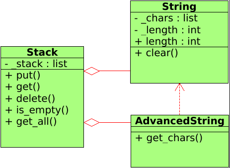

# string-stack 

### [OTUS](https://otus.ru) homework

#### Goal:
Create program using the basic OOP principles:
- encapsulation
- polymorphism
- inheritance

#### Class diagram:



#### Description:
##### Stack
There is a my own realization of stack which can contain anything. 
Some basic operation:
```python
from string_stack.stack import Stack

stack = Stack()
stack.is_empty()         # True

stack.put(123)           # int
stack.put('text')        # str
stack.put([5,5,5])       # list

stack.get_all()          # [123, 'text', [5, 5, 5]]

stack.get()              # [5, 5, 5]
stack.delete()       
stack.get()              # 'text'
```
##### String
String is a very cut version of string. AdvancedString is a child class which has one more method get_chars.
 ```python
from string_stack.string import String, AdvancedString
 
string = String('test text')
string.length                # 9
string.clear()
string.length                # 0

advanced_string = AdvancedString('test text')
advanced_string.get_chars()  # ['t', 'e', 's', 't', ' ', 't', 'e', 'x', 't']
```

For more details look examples.
